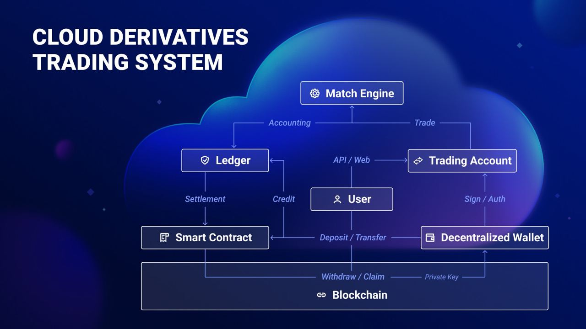

# CubSwap

### Introducción

CubSwap protocolo de comercio derivado descentralizado. Gracias a CubSwap logramos un alto rendimiento de transacciones y velocidades de respuesta rápida, a tiempo que garantiza la seguridad y transparencia de los fondos y transacciones. Contamos con una gran profundidad de mercado así como liquidez.

### Arquitectura e implementación

Los usuarios conectan sus billeteras descentralizadas a través de la interfaz Web3. Luego podrán transferir tokens (ERC-20/BEP-20) al contrato inteligente para la custodia y liquidación de fondos. Una vez que se registra el libro mayor fuera de la cadena, los usuarios pueden usar los fondos para negociar derivados fuera de la cadena y el PnL se contabilizará en el libro mayor. Después de la liquidación, los usuarios pueden retirar los fondos llamando al contrato inteligente (excepto el margen ocupado por las posiciones abiertas y las órdenes pendientes).

#### &#x20;                                                                         ApolloX

### Beneficios

#### Operando con CubSwap los usuarios pueden disfrutar de los siguientes beneficios

* Intuitivo:

Excelente velocidad en nuestro DEX. Operar rápidamente en una plataforma fácil de usar.

* Privacidad:

Sin necesidad de registrarse, solo conecte su billetera y a operar.

* Tarifas de gas

Los usuarios pueden ahorar tarifas de gas pagando a los mineros por transacción.

* Seguridad

Comercio directo sin intermediarios. Más autonomía en un entorne descentralizado.
