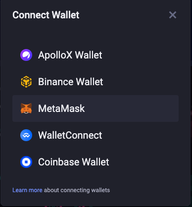
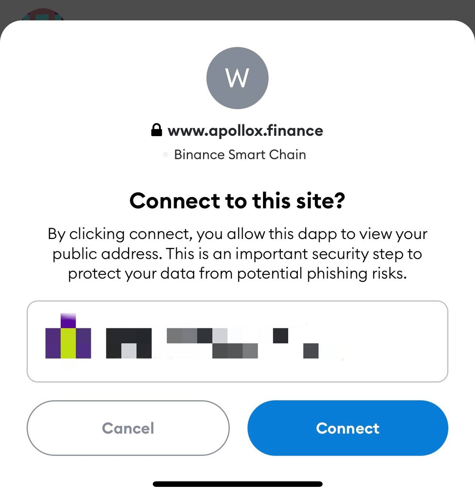
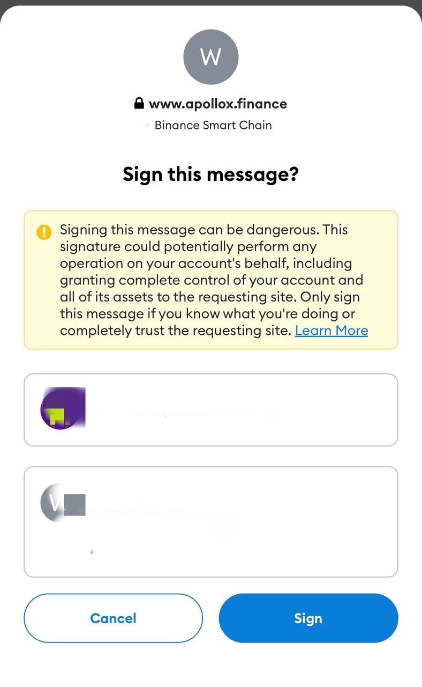

# Conectar billetera

### Lista de monederos disponibles

Estas son las billeteras que admitimos:

Si no tiene Binance Wallet o Metamask Wallet arriba, puede hacer clic a continuación para obtener más información:

* Monedero Binance
* Metamask
* Monedero Coinbase

Si está utilizando carteras de aplicaciones u otras carteras, consulte aquí la lista de carteras compatibles con WalletConnect. Siempre que su billetera esté en la lista, puede conectar su billetera a través de WalletConnect.

## Conecte su billetera

### 1. Haga clic en conectar billetera en la parte superior derecha.

### 2. Elija y haga clic en la billetera que usa. (Asegúrese de que su red esté en BSC)

Binance Wallet y MetaMask Wallet son para extensión web

Si está utilizando billeteras de aplicaciones o billeteras que no sean Binance y MetaMask, marque aquí

### 3. Confirma en tu Wallet

Una vez que elija conectar su billetera, habrá un mensaje de confirmación en su billetera. Confirme la conexión y firme. Actualice el sitio web y podrá comenzar a operar.

### Conecte Metamask a Binance Smart Chain (BSC)

Metamask es una billetera descentralizada en ERC20. Se puede instalar en su navegador web (por ejemplo, Chrome), teléfono móvil IOS o Android. Si desea descargar Metamask, [_**Download Page**_](https://metamask.io/download.html).

Para la siguiente demostración, estamos usando la aplicación Metamask IOS. No te preocupes, los pasos para todas las plataformas son similares.

Después de crear o iniciar sesión en su cuenta, puede verificar la Red en la parte superior. Muestra en qué red blockchain estás. Haz clic y te mostrará todas las redes que tienes.
