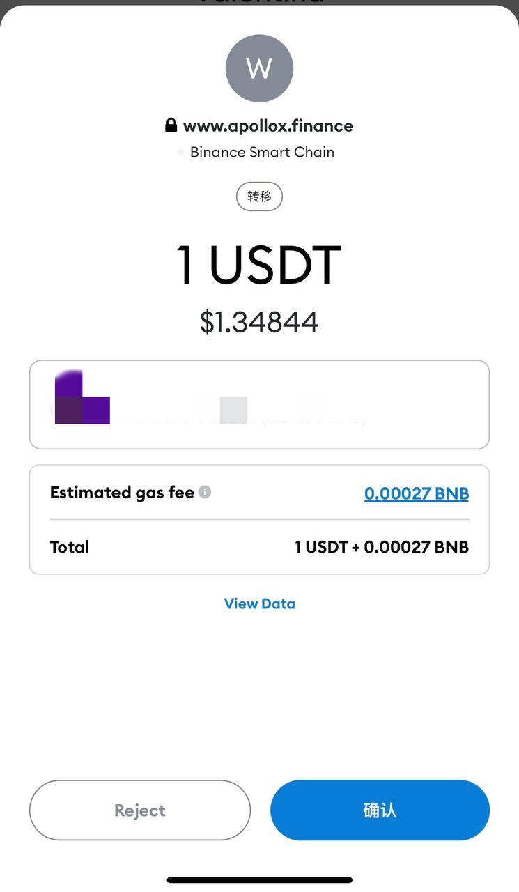
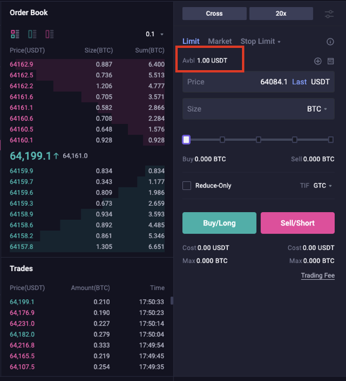
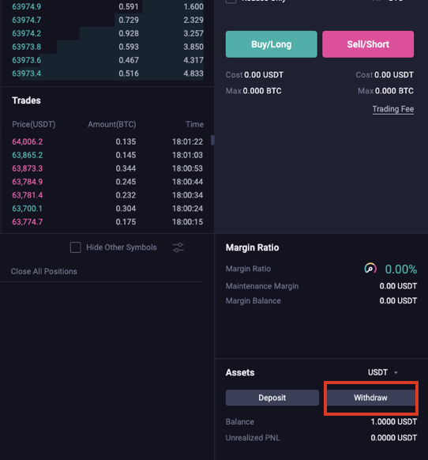
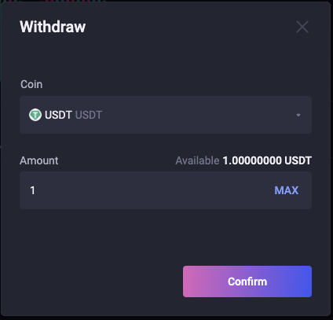
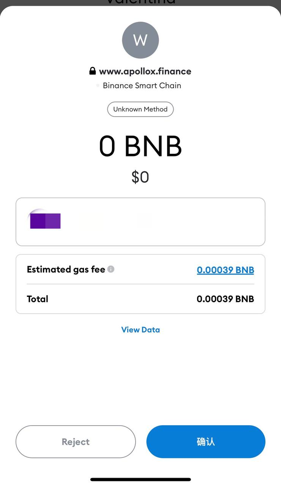

# Depositar & Retirar

## Deposito

1\. Haga clic en \[ **+** ] y elija la moneda criptográfica y la cantidad que desea transferir. Podrás ver tu saldo en tu Wallet.

.png>)

.png>)

2\. Confirma la transferencia en tu monedero.

3\. Después de la transferencia, podrá ver su fondo aquí.

## Retirar:

1. Haga clic en \[ **Retirar** ] y elija la moneda criptográfica y la cantidad que desea transferir.

2\. Confirma la transferencia en tu monedero.

3\. Luego, podrá ver los fondo en su billetera.
